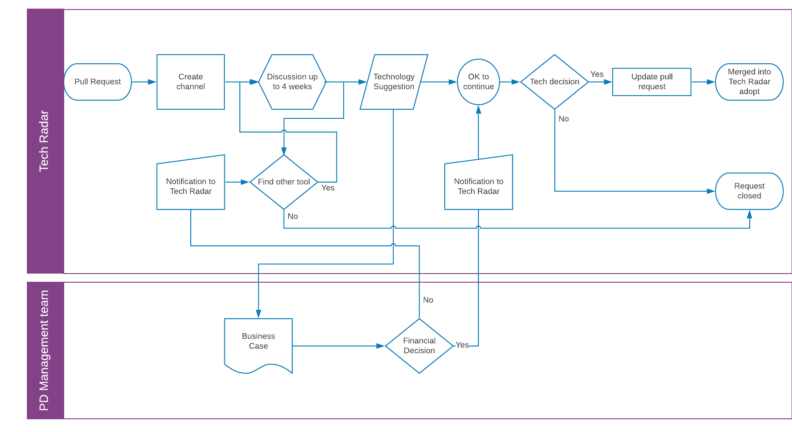

# Tech Radar adopt

## Process diagram

## Add to Adopt

### Open Pull Request in the tech-radar repo (chapter)
A pull request is opened by any member of the organization about moving a blip to adopt part of the radar. Tech-radar maintainer reviews the pull request and makes an initial sanity check together with the relevant Chapter on the proposed move.

| What        | Who                   | Deliverable    | Template   |
|-------------|-----------------------|----------------|------------|
| Responsible | Anyone                | Pull Request   | Tech-radar |
| Accountable | Tech Radar maintainer | Review         | -          |
| Consulted   | Chapter               | Validity check | -          |
| Informed    | -                     | -              | -          |

#### Link to webpage
[https://tech-radar.extendaretail.com/](https://tech-radar.extendaretail.com/)
#### Link to repository
[https://github.com/extenda/tech-radar](https://github.com/extenda/tech-radar)

### Create a slack channel (tech-radar maintainer)
Thereafter the maintainer creates a channel with the format #decision-XXX (for example for a frontend framework decision the channel could be “#decision-frontend-fw”). The name should capture a broader perspective than just the specific tool or framework in questions such that new ideas or solutions can come to light in the following discussion.

| What        | Who                   | Deliverable   | Template |
|-------------|-----------------------|---------------|----------|
| Responsible | Tech Radar maintainer | Slack channel | Slack    |
| Accountable | Tech Radar maintainer | -             | -        |
| Consulted   | -                     | -             | -        |
| Informed    | -                     | -             | -        |

### Invite stakeholders and announce channel (tech-radar maintainer)
When the channel is created at least one stakeholder of each tribe should be invited. If unsure on which stakeholders to invite, invite the head of tribe. The channel creation should also be announced in #product-engineering-announcements to let all developers take part.

| What        | Who                                     | Deliverable  | Template            |
|-------------|-----------------------------------------|--------------|---------------------|
| Responsible | Tech Radar maintainer                   | Announcement | Slack               |
| Accountable | Tech Radar maintainer                   | -            | -                   |
| Consulted   | -                                       | -            | -                   |
| Informed    | PD (#product-engineering-announcement) | -            | Maintainer template |

### Discussion, time box 4 weeks (PE / Anyone)
When the channel has been created there should be a time for discussion. This discussion should be limited to a maximum of 4 weeks per tool.

If there is a consensus around the proposal the time could be reduced by the decision of the Radar maintainers. However only PE Senior Management can give approval of prolonged discussion.

This discussion should land in a proposal for how the organization should approach the technology/framework going forward, each different proposal should go to the next step for evaluation even if there is no majority around the proposal in question.

| What        | Who                              | Deliverable            | Template     |
|-------------|----------------------------------|------------------------|--------------|
| Responsible | PE / Anyone                      | Technology suggestion  | Pull Request |
| Accountable | Radar maintainers                | Moderation, Time limit | -            |
| Consulted   | Sales/Legal/PS&M/PE Stakeholders | -                      | -            |
| Informed    | N/A                              | -                      | -            |

### Technology Suggestion (Technology backer)
The original PR should go directly to this step and the backers behind the proposal should write a business case for the technology. When someone in the discussion
proposes a new technology a technology suggestion (PR) should be made. If it is something new that has come up in the suggestion the document should hold the same information as the corresponding pull request.

| What        | Who                              | Deliverable     | Template                                                                                                          |
|-------------|----------------------------------|-----------------|-------------------------------------------------------------------------------------------------------------------|
| Responsible | Technology backer                | Impact Analysis | [Business case](https://docs.google.com/document/d/1Ga_EfSCBbkriFezPf5Gt7fx2rvUW9ALKTpDoppDlXLA/edit?usp=sharing) |
| Accountable | Technology backer                | -               | -                                                                                                                 |
| Consulted   | PE operations team               | -               | -                                                                                                                 |
| Informed    | Sales/Legal/PS&M/PE Stakeholders | -               | -                                                                                                                 |

### License & Contract Review and Impact Analysis “Business case” (PE Operations)
When proposals are taking shape these should be lifted to the PE operations team who are responsible for the review. The PE operations team will make an analysis to determine if the suggested technologies impact the organization in a negative way from a financial and legal perspective.

| What        | Who                              | Deliverable     | Template |
|-------------|----------------------------------|-----------------|----------|
| Responsible | PE Operations team               | Impact Analysis | -        |
| Accountable | PE Operations Manager            | -               | -        |
| Consulted   | Sales/Legal/PS&M/PE Stakeholders | Requirements    | TBD      |
| Informed    | PE Senior management             | -               | -        |

### PE senior management forum “Financial Decision” (Senior managers)
After the contract review and impact analysis is complete the proposal and material is lifted to the PE senior managers for review. Senior management makes decisions on whether the tool is viable from a business perspective.

| What        | Who                                         | Deliverable                                         | Template                    |
|-------------|---------------------------------------------|-----------------------------------------------------|-----------------------------|
| Responsible | PE Senior Managers                          | Meeting, Decision, Notification to decision channel | -                           |
| Accountable | PE Senior Managers                          | -                                                   | -                           |
| Consulted   | Tech Radar maintainer, contract responsible | Presentation                                        | Pull Request, Business Case |
| Informed    | Decision channel                            | -                                                   | -                           |

### Find other tools (PE)
If the tool is **not** deemed viable from a business perspective the discussion channel is informed and if there are no other tools currently under evaluation the organisation has to come up with a new suggestion or a decision to not adopt any new framework or tool.
If the decision is to not adopt any tool the process should be closed, go to the "Pull request is rejected (Tech Radar maintainer)".

| What        | Who     | Deliverable          | Template |
|-------------|---------|----------------------|----------|
| Responsible | PE      | Suggestion, Decision | -        |
| Accountable | Chapter | Decision             | -        |
| Consulted   | -       | -                    | -        |
| Informed    | -       | -                    | -        |

### Tech decision (PE)

Once proposals have been discussed it is laid forward to the product engineering management.
The decision and responsibility to adopt a technology lies with the engineering
management as they accountable for the engineering organisation.

The outcome of previous steps are input to the decision makers

  * Tech radar maintainers are the facilitators in the process
  * The CTO and principal architect are responsible for the decision
  * There is no popular vote
  * The decision is published in Slack by the tech radar maintainers

| What        | Who                   | Deliverable                                   | Template             |
|-------------|-----------------------|-----------------------------------------------|----------------------|
| Responsible | Tech Radar maintainer | Present proposal                              | -                    |
| Accountable | CTO and Principal SA  | Adopt decision                                | -                    |
| Consulted   | -                     | -                                             | -                    |
| Informed    | Tech radar maintainer | Announce in #product-engineering-announcement | Maintainer templates |

### Update pull request (stakeholders)
Update the pull request with new information, business case etc

| What        | Who                   | Deliverable              | Template              |
|-------------|-----------------------|--------------------------|-----------------------|
| Responsible | Tech-radar maintainer | Meeting, Meeting minutes | Agenda, TBD           |
| Accountable | PE Operations Manager | Decision                 | TBD                   |
| Consulted   | Stakeholders          | Presentation             | Max 5min presentation |
| Informed    | PE-senior-management  | -                        | TBD                   |

### Pull request is merged (Tech Radar maintainer)
After approval from PE senior management, the pull request is updated with any new information and thereafter merged to update the Tech Radar.

| What        | Who                   | Deliverable         | Template |
|-------------|-----------------------|---------------------|----------|
| Responsible | tech-radar maintainer | Merged PR           | -        |
| Accountable | Chapter               | Updated description | -        |
| Consulted   | -                     | -                   | -        |
| Informed    | -                     | -                   | -        |

### Pull request is rejected (Tech Radar maintainer)
If the technology suggestion has been rejected for either financial or technological reasons the pull request should be updated with the information and closed by the Tech Radar maintainers.

| What        | Who                   | Deliverable         | Template |
|-------------|-----------------------|---------------------|----------|
| Responsible | Tech Radar maintainer | Merged PR           | -        |
| Accountable | Chapter               | Updated description | -        |
| Consulted   | -                     | -                   | -        |
| Informed    | -                     | -                   | -        |

### Pricing and Licensing decision for customers (PS&M, if applicable)

| What        | Who   | Deliverable       | Template |
|-------------|-------|-------------------|----------|
| Responsible | PS&M  | Pricing/Licensing | -        |
| Accountable | PS&M  | -                 | -        |
| Consulted   | Sales | -                 | -        |
| Informed    | PE    | -                 | -        |

### Create & negotiate contract (if applicable)

| What        | Who                 | Deliverable      | Template |
|-------------|---------------------|------------------|----------|
| Responsible | Operations Team PE  | License contract | -        |
| Accountable | Operations Team PE  | -                | -        |
| Consulted   | Contract Management | -                | -        |
| Informed    | -                   | -                | -        |

### License control setup (if applicable)

| What        | Who                 | Deliverable                         | Template |
|-------------|---------------------|-------------------------------------|----------|
| Responsible | Operations Team PE  | License object / Controlling object | -        |
| Accountable | Operations Team PE  | -                                   | -        |
| Consulted   | Contract Management | -                                   | -        |
| Informed    | -                   | -                                   | -        |

## Remove from adopt

### Chapter analysis
Chapters do an analysis of their basket of technologies on a yearly basis. Ranking the technologies on how important they are for the company.

| What        | Who                | Deliverable        | Template |
|-------------|--------------------|--------------------|----------|
| Responsible | Chapter            | Analysis report    | TBD      |
| Accountable | Chapter            | -                  | -        |
| Consulted   | Operations Team PE | Budget constraints | -        |
| Informed    | PS                 | -                  | -        |

### Open Pull Request in tech-radar repo (chapter)
A pull request is opened by any member of the relevant chapter about moving a blip away from adopt part of the radar.

| What        | Who                                         | Deliverable  | Template    |
|-------------|---------------------------------------------|--------------|-------------|
| Responsible | Chapter                                     | Pull Request | Tech-radar  |
| Accountable | Chapter                                     | -            | -           |
| Consulted   | N/A                                         | -            | -           |
| Informed    | Tech-radar maintainer, Contract responsible | -            | #tech-radar |

### Contract Review and Impact Analysis (Contract responsible)
After the pull request has been opened the contract responsible is informed which does a contract review and impact analysis of the change.

| What        | Who                              | Deliverable     | Template |
|-------------|----------------------------------|-----------------|----------|
| Responsible | Operations Team PE               | Impact Analysis | TBD      |
| Accountable | Operations Team PE               | -               | -        |
| Consulted   | Sales/Legal/PS&M/PE Stakeholders | Requirements    | TBD      |
| Informed    | PE-senior-management             | -               | -        |

### PE senior management forum (Senior managers)
When the contract review and impact analysis is complete the proposal and material is lifted to the PE senior managers for formalisation. Senior management can determine if the business impact is to large and what steps should be taken before a removal is approved.

|             |                                             |                         |                       |
|-------------|---------------------------------------------|-------------------------|-----------------------|
| What        | Who                                         | Deliverable             | Template              |
| Responsible | PE Senior Managers                          | Meeting,Meeting minutes | TBD                   |
| Accountable | PE Senior Managers                          | Decision                | TBD                   |
| Consulted   | tech-radar maintainer, contract responsible | Presentation            | Max 5min presentation |
| Informed    | PE-senior-management                        | -                       | TBD                   |

### Pull request is merged (tech-radar maintainer)
After approval from PE senior management the pull request is updated with any new information and there after merged to update the tech-radar. The whole PE should also be informed by an announcement in #product-engineering-announcement.

| What        | Who                   | Deliverable                       | Template |
|-------------|-----------------------|-----------------------------------|----------|
| Responsible | tech-radar maintainer | Merged PR                         | -        |
| Accountable | Chapter               | Updated description, Announcement | -        |
| Consulted   | -                     | -                                 | -        |
| Informed    | PE (#pd-announcement) | -                                 | -        |
